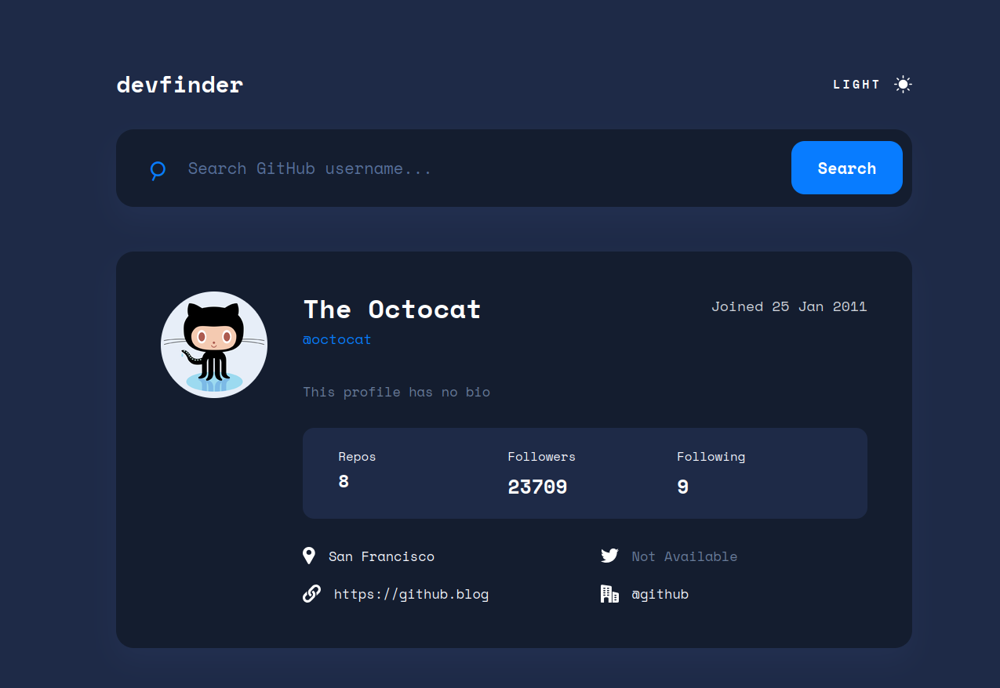

# Frontend Mentor - GitHub user search app

## Welcome! 👋

This is a solution to the [GitHub user search app challenge on Frontend Mentor](https://www.frontendmentor.io/challenges/github-user-search-app-Q09YOgaH6). Frontend Mentor challenges help you improve your coding skills by building realistic projects.

### Links

- My Solution: [here](https://yehudahason.github.io/github-user-search-app/)

### Built with

- Semantic HTML5 markup
- Tailwind
- Flexbox
- CSS Grid
- Mobile-first workflow
- [React](https://reactjs.org/) - JS library

## Author

- Frontend Mentor - [Yehuda Hason](https://www.frontendmentor.io/profile/yehudahason)
